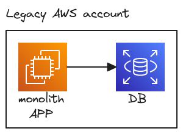
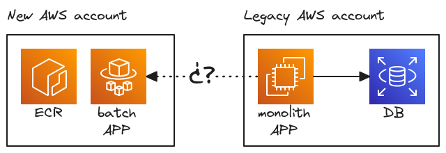
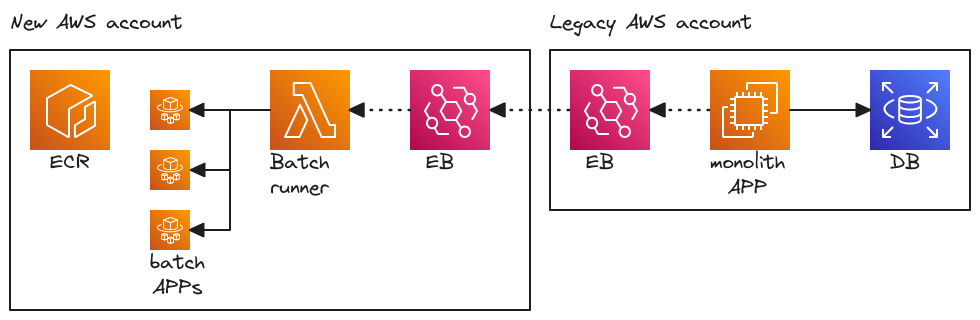
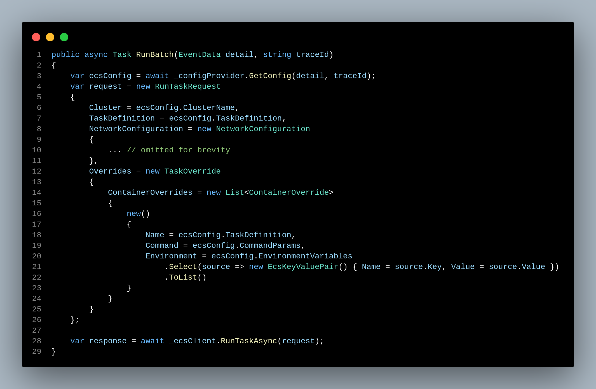
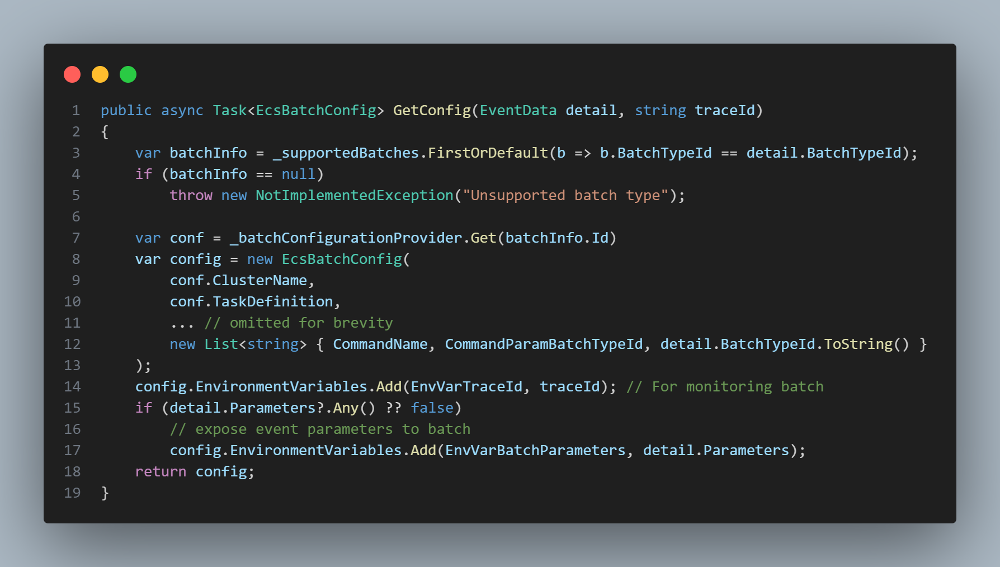
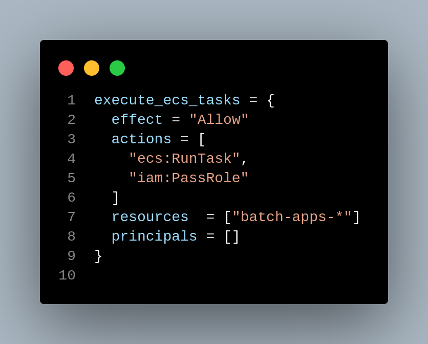
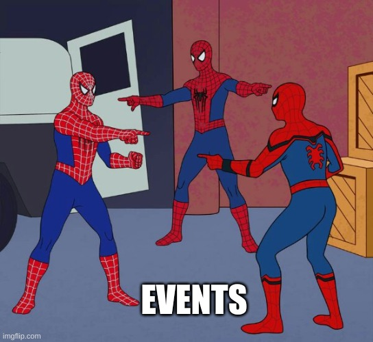
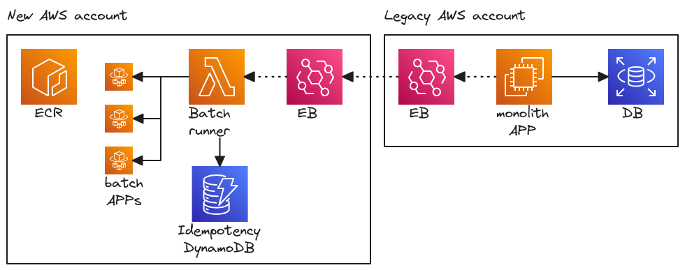
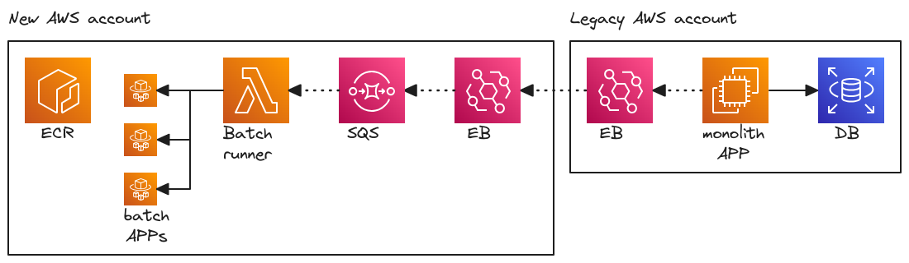
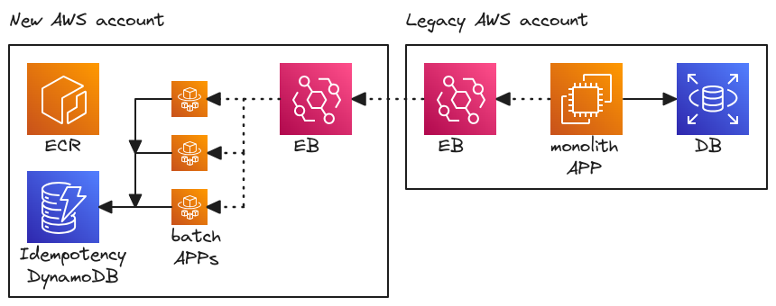

<!--
_class: invert
-->

# **Functionless batch processing with EB**

1. **About me**
2. **Situation**
3. **What we did**
4. **What we learnt**

<!-- TODO: check all with grammarly -->

---

# **About me**

- I am Carlos Angulo
- I work at [Ohpen](https://www.ohpen.com) as a Platform Engineer
- I have more than 7 years of experience
- You can find me on [LinkedIn](www.linkedin.com/in/angulomascarell) or [GitHub](https://github.com/cangulo)

---

# **Situation**

We have a legacy monolith app running in EC2 + RDS

<!-- TODO: Diagram with legacy AWS account with the EC2 and DB-->

---

# **Dockerization**

We dockerize some batch apps in a new account

_How would you trigger those apps from the monolith?🤔_

<!-- TODO: Diagram with two AWS accounts with a line connecting them including a question mark in the middle-->

---

# **What we did**

We decide to trigger batches based on events

<!-- Comment: 
  - We create the batch runner lambda reusing monolith code
  - lambda triggers different task based on the event type
  - It was the solution with less changes for developers
  - Lambda must be in the same NWK as ECS
-->

---

<!-- Comment: 
  - DotNet, so developer friendly
  - Here we first get the ecsConfig, so the configuration for the Task execution
  - Please note there is some NWK configuration as VPC, SG, subnets
-->

---

<!-- Comment: 
  - Here we get the ECS config for the btach provided in the event
  - Please note
    - We get the batchInfo filter by the BatchTypeId 
    - We provide a TraceId as EV for monitoring
    - We provide the event parameters (parameters for bussiness) as EV
-->

---

<!-- Comment: 
  - Permissions
  - DotNet, so developer friendly
  - ContainerOverrides, we can customize the execution based on the event 
-->

---

# **wait**

What about duplicated events?

<!-- Comment: 
  - How do you avoid duplicate executions? This is a idempotency problem
  - One option is to use a Dynamo DB to store and idempotency key for each execution
-->

---

**Idempotency** with DynamoDB

<!-- store an idempotency key in a DynamoDB -->

<!-- Comment: 
  - Each event we receive will be hashed into an idempotency key
  - The lambda will ensure before each execution, the event is unique
-->

---

**Idempotency** with SQS

<!-- 
  comment:s
  - No code change needed!☁️
  - We solve this using SQS instead of code + DB. 💸 
-->

---

**simpler solution?**

<!-- Comment: 
  - We realize we can skip the lambda and trigger the batches directly
  - We realize we can trigger directly the task with EB
  - We have to give EB the same permissions we gave to the lambda before
-->

---

# **What we learn**

- lambda (+ SQS) offers more control
- EB + ECS is simpler but more expensive and adds logic to batch apps

<!-- 
Comments:
Event Bridge and service integration
Are they worth it for us?
- More costly since Fargate charges you 1 minute per execution.
- We would be required to implement idempotency at the batch level
- Pretty much the same amount of code, just in a different place. 
-->

---

# **Questions?**
